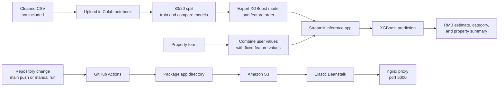

# Beijing Property Price Prediction | XGBoost + Streamlit

A machine learning project that estimates Beijing property prices with a saved XGBoost regression model and a Streamlit interface. This repository includes the inference app, model artifacts, a Colab-oriented training notebook, and AWS Elastic Beanstalk deployment configuration.

> **Scope:** This is a historical-data machine-learning demonstration, not a current-market valuation or financial recommendation. The training CSV is not included, and the notebook's saved results have not been independently reproduced from the repository contents.

## What It Does

Users enter selected property details in the sidebar: area, living rooms, bathrooms, construction year, floor, community average price, district, subway proximity, and elevator availability. The app combines these values with fixed assumptions, arranges the row using the saved feature-column order, and passes it to the XGBoost model. It displays an estimated price, a broad price category, and a property summary.

The app reports Chinese yuan (RMB) and multiplies the model output by 10,000 when displaying the estimate. That conversion is an assumption in the app; the prediction metrics below are in the notebook's `totalPrice` target units.

## Model Evaluation

The notebook uses an 80/20 train/test split with `random_state=42`. These are values stored in the notebook's existing output; the cleaned CSV required to reproduce them is not committed.

| Model | MAE | RMSE | R² |
| --- | ---: | ---: | ---: |
| Linear Regression | 71.84 | 113.35 | 0.7569 |
| Random Forest | 26.54 | 57.46 | 0.9375 |
| XGBoost | 28.34 | 52.98 | 0.9469 |

Random Forest has the lowest MAE in the saved comparison; XGBoost has the lowest RMSE and highest R² there. The app displays the XGBoost results as fixed text rather than calculating evaluation metrics at runtime. No performance guarantee is implied.

## Architecture



The dataset is not fetched by the app. The notebook expects an already-cleaned file named `beijing_housing_cleaned.csv` and uses Google Colab upload/download helpers. The repository's root-level GitHub Actions workflow is configured to package the app directory and update an Elastic Beanstalk environment; its presence does not confirm a successful deployment or a live service.

## Run Locally

Use Python 3.11, matching `BeijingHousePricePrediction/runtime.txt`. From the repository root:

```bash
cd BeijingHousePricePrediction
python3 -m venv .venv
source .venv/bin/activate
pip install -r requirements.txt
streamlit run app.py
```

Open <http://localhost:5000>. The port is set in `.streamlit/config.toml`. The app loads `xgboost_house_price.pkl` and `feature_columns.pkl` from the same directory at startup; both files must be present and compatible with the installed libraries.

## Training Notebook

Open [`BeijingHousePricePrediction/House_Price_Prediction.ipynb`](BeijingHousePricePrediction/House_Price_Prediction.ipynb) in Google Colab, provide the cleaned CSV, and run the cells to compare Linear Regression, Random Forest, and XGBoost. The notebook saves the XGBoost model and feature-column order and contains analysis outputs, including feature importance and residual plots.

The notebook is Colab-oriented rather than a turnkey local training script. Its imports include scikit-learn, Matplotlib, and `google.colab`; those training dependencies are not listed in the app's `requirements.txt`. The dataset-cleaning process and cleaned dataset are not included.

## Technology and Repository Map

| Path | Purpose |
| --- | --- |
| [`BeijingHousePricePrediction/app.py`](BeijingHousePricePrediction/app.py) | Streamlit form, feature assembly, inference, and result display |
| [`BeijingHousePricePrediction/House_Price_Prediction.ipynb`](BeijingHousePricePrediction/House_Price_Prediction.ipynb) | Colab-based model comparison and evaluation |
| [`BeijingHousePricePrediction/xgboost_house_price.pkl`](BeijingHousePricePrediction/xgboost_house_price.pkl) | Serialized XGBoost model |
| [`BeijingHousePricePrediction/feature_columns.pkl`](BeijingHousePricePrediction/feature_columns.pkl) | Feature order expected by the model |
| [`BeijingHousePricePrediction/requirements.txt`](BeijingHousePricePrediction/requirements.txt) | Runtime Python dependencies |
| [`BeijingHousePricePrediction/Procfile`](BeijingHousePricePrediction/Procfile) | Elastic Beanstalk web process command |
| [`.github/workflows/deploy-eb.yml`](.github/workflows/deploy-eb.yml) | Repository-root AWS deployment workflow |
| [`BeijingHousePricePrediction/.ebextensions/`](BeijingHousePricePrediction/.ebextensions/) and [`BeijingHousePricePrediction/.platform/`](BeijingHousePricePrediction/.platform/) | Elastic Beanstalk and nginx configuration |

There is no database or application API in the inference path.

## Deployment Configuration

The repository-root workflow runs on pushes to `main` or by manual dispatch. It expects these GitHub Actions secrets: `AWS_ACCESS_KEY_ID`, `AWS_SECRET_ACCESS_KEY`, `AWS_SESSION_TOKEN`, and `AWS_REGION`. It packages files from `BeijingHousePricePrediction/`, uploads the package to S3, and requests an Elastic Beanstalk environment update. Deployment requires valid AWS credentials and the referenced AWS resources.

## Limitations and Security

- The cleaned training data is absent, so the saved notebook results cannot be reproduced from this repository alone.
- The app uses a 2017 trade-year reference and fixed location/building feature values. District selection does not update the fixed longitude and latitude.
- The app exposes only a subset of the model's 23 features and provides no prediction interval.
- The app's RMB conversion assumes 10,000 RMB per model-output unit; verify the source dataset's target convention before interpreting estimates.
- Model and feature-order artifacts are loaded with `joblib`. Only use trusted artifacts.
- Streamlit CORS and XSRF protections are disabled in the committed configuration. Review those settings and add appropriate access controls before exposing the app publicly.
- No automated tests or model-serving API are included.

## Data Source

The notebook README references the [Beijing Housing dataset on Kaggle](https://www.kaggle.com/datasets/ruiqurm/lianjia). The repository contains neither that source data nor the cleaned CSV used by the notebook.